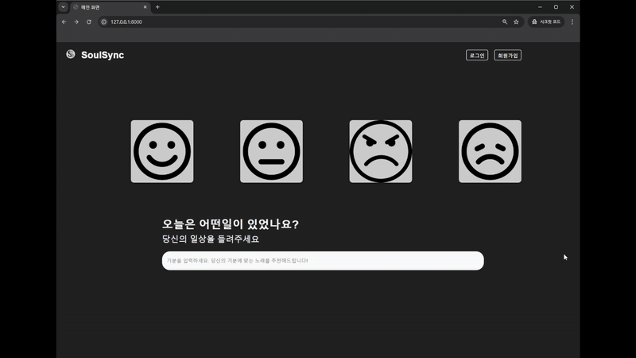
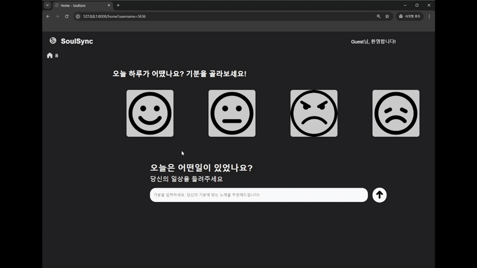
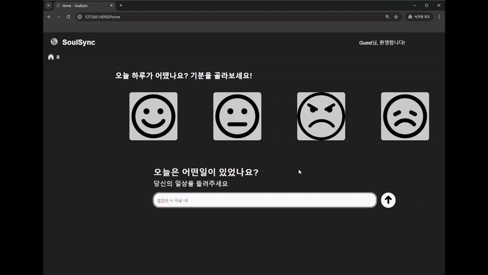

# SoulSync

## 1. 프로젝트 개요

### 한 줄 요약
> 사용자의 감정을 분석하여 그 기분에 맞는 음악과 위로의 메시지를 추천해주는 맞춤형 음악 추천 시스템

### 해결하고자 하는 문제
- 기존 음악 추천 서비스는 주로 사용자의 청취 이력이나 선호 장르에 초점을 맞추고 있어, 사용자의 **현재 감정**을 반영하지 못함
- SoulSync는 사용자가 자신의 감정을 이미지 또는 텍스트 입력을 통해 표현하면, AI 모델이 이를 분석하여 해당 감정에 어울리는 음악과 공감 메시지를 제공함으로써, 보다 개인화된 경험을 제공함

### 주요 기능
- **감정 분석**: 사용자가 입력한 텍스트를 기반으로 AI 모델이 감정을 분석
- **맞춤 음악 추천**: 분석된 감정에 따라 CSV 데이터에서 적합한 노래 목록을 필터링하여 추천
- **공감 메시지 제공**: 감정에 따른 위로 및 격려 메시지를 함께 전달

---

## 2. 프로젝트 구조

```bash
SOULSYNC
├── data
│   └── songs.csv              # 노래 데이터 CSV 파일
├── models
│   └── emotion_model.py       # AI 모델 로딩 및 감정 분석 
├── static
│   ├── css                    # CSS 파일 
│   ├── images                 # 이미지 파일 (로고, 아이콘 등)
│   └── js                     # 자바스크립트 파일 
├── templates
│   ├── box.html               # 기분 선택 페이지 템플릿
│   ├── home.html              # 로그인 후 홈 페이지 템플릿
│   ├── index.html             
│   ├── list.html              
│   ├── main_home_pli.html     # 로그인 후 홈 페이지 템플릿
│   └── signup.html            # 회원가입
├── utils
│   ├── auth.py                # 로그인/회원가입 관련 기능
│   ├── database.py            # 데이터베이스 연결 및 초기화
│   ├── pages.py               
│   ├── recommendation.py      # 감정 분석 후 추천 기능
│   └── sentiment.py           # 감정 분석 후 추천 기능 
├── venv                       # 가상환경
├── main.py                    # FastAPI 서버 메인 
├── requirements.txt           # 의존성 패키지 목록
└── README.md                  # 이 파일
```
### 주요 파일 및 역할 설명

- **`main.py`**: FastAPI 애플리케이션의 진입점으로, 라우팅 및 미들웨어(세션 등) 설정을 담당
- **`models/emotion_model.py`**: Hugging Face의 `rkdaldus/ko-sent5-classification` 모델을 로드하고, 감정 분석 로직을 구현
- **`utils/auth.py`**: 사용자 인증(로그인, 회원가입, 로그아웃) 관련 기능을 제공
- **`utils/recommendation.py`**: 사용자의 감정 입력에 따라 CSV 데이터를 필터링하고, 추천 결과와 위로 메시지를 포함한 HTML 템플릿을 렌더링
- **`templates/`**: Jinja2 템플릿 파일들이 위치하며, 클라이언트에 렌더링된 HTML을 제공
- **`static/`**: CSS, 이미지, JavaScript 등의 정적 파일들이 저장
- **`data/`**: 노래 데이터 CSV 파일(예: `songs.csv`) 및 DB 파일(예: `users.db`)이 포함
- **`requirements.txt`**: 프로젝트의 의존성 패키지 목록을 정의
- **`venv/`**: 가상환경 폴더

---

## 3 기술 스택
### 3.1 기술 스택
- **Backend:** FastAPI, Python
- **AI/ML:** PyTorch, Hugging Face Transformers (KoBERT 기반 모델)
- **데이터베이스:** SQLite (또는 필요에 따라 다른 DB 사용)
- **Frontend:** HTML, CSS, JavaScript, Jinja2 템플릿
- **서버:** Uvicorn

---

## 4. 설치 및 실행 방법

### 4.1 Git 클론
```bash
git clone https://github.com/hzzz15/Soulsync.git
cd SOULSYNC
```

### 4.2 가상환경 설정
```bash
# 맥/리눅스
python3 -m venv venv
source venv/bin/activate
```

```bash
# 윈도우
python -m venv venv
venv\Scripts\activate
```

### 4.3 의존성 패키지 설치
```bash
pip install -r requirements.txt
```

### 4.4 서버 실행
```bash
uvicorn main:app --reload
```
- 기본 포트: http://127.0.0.1:8000
- API 문서: http://127.0.0.1:8000/docs

### 4.5 사용 예시
실행
- 회원가입/로그인: /signup 및 /login 페이지에서 사용자 인증을 진행
- 감정 입력 및 추천: 홈 페이지(/home)에서 텍스트 입력으로 감정을 전달하면, FastAPI가 AI 모델을 호출하여 감정 분석을 수행하고, 해당 감정에 맞는 노래 추천과 위로 메시지가 포함된 결과 페이지를 제공

---

## 5. 참고자료
### 참고자료  
이 프로젝트는 다음과 같은 기술 및 리소스를 참고하여 개발되었습니다:

- **AI 모델**: [Hugging Face - rkdaldus/ko-sent5-classification](https://huggingface.co/rkdaldus/ko-sent5-classification)
- **웹 프레임워크**: [FastAPI](https://fastapi.tiangolo.com/)
- **머신러닝 라이브러리**: [PyTorch](https://pytorch.org/)
- **템플릿 엔진**: [Jinja2](https://jinja.palletsprojects.com/)
- **아이콘 및 디자인 참고**: [FontAwesome](https://fontawesome.com/)
- **서버 배포**: [Uvicorn](https://www.uvicorn.org/)

---

## 6. 팀원 소개
- 강희지: AI / Backend / Frontend
- 송종욱: DB
- 신효진: Frontend / Design
- 지은혜: Frontend / Crawling
- 권승빈: Frontend
- 박성빈: Frontend

---

## 7. 시연 영상
- 회원가입 / 로그인

- 박스 선택 노래 추천

- 박스 선택 노래 추천


--

- SoulSync는 사용자의 감정을 기반으로 한 차별화된 음악 추천 서비스를 제공합니다.
- 즐거운 음악 감상과 함께, 감정에 맞는 공감을 경험해보세요!
